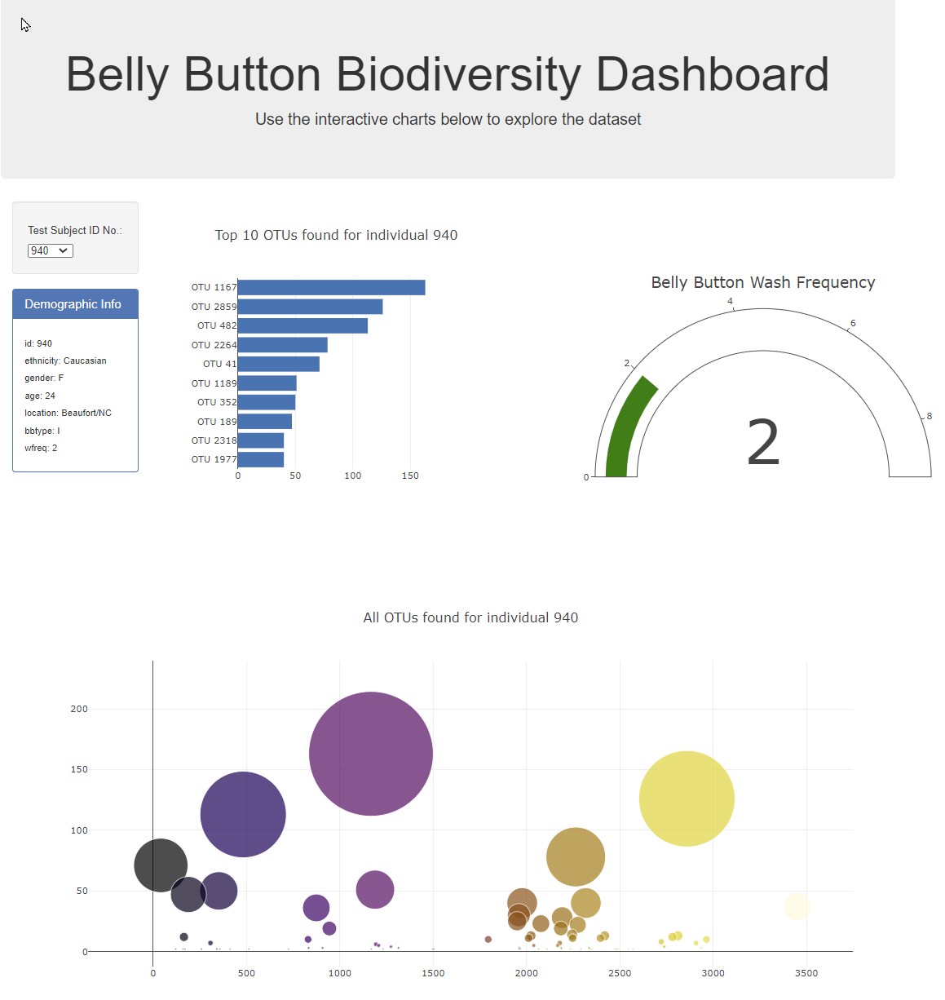

# Plot.ly Homework - Belly Button Biodiversity

This interactive dashboard has been set up to display the diversity of micro bial species within the belly button from 152 samples(people).

The dataset reveals that a small handful of microbial species (also called operational taxonomic units, or OTUs, in the study) were present in more than 70% of people, while the rest were relatively rare. 

This figure shows selector - simply chose the Subject Id that you wish to look at.  

Have a look and check out! Explore belly button creatures!!

